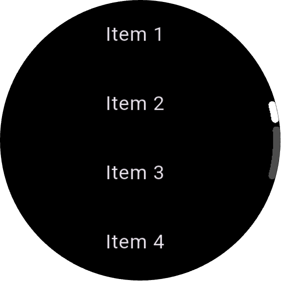
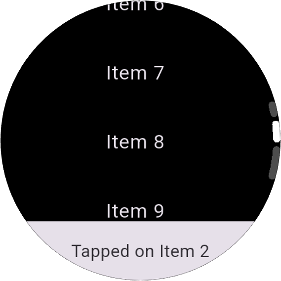
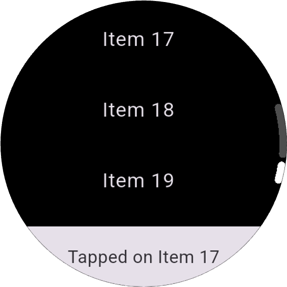

# WearOS Scrollbar

[](https://pub.dev/packages/wear_os_scrollbar)
[](https://github.com/Piero16301/wear_os_scrollbar/actions)
[](https://codecov.io/gh/Piero16301/wear_os_scrollbar)
[](https://github.com/Piero16301/wear_os_scrollbar)
[](https://opensource.org/licenses/MIT)
[](https://buymeacoffee.com/sanjuanpamk)

A Flutter plugin that implements an elegant, expressive scroll indicator for Wear OS devices, following the Material 3 Expressive design guidelines for Wear OS 6.

This package provides a customizable circular scrollbar that automatically responds to physical rotary input (such as a rotating bezel or crown) and provides haptic feedback, making your Wear OS applications feel truly native and premium.

## ✨ Features

* **Material 3 Expressive Design:** Modern, sleek circular scrollbar tailored specifically for round screens.
* **Native Rotary Input:** Automatically listens to the physical rotary encoder (crown/bezel) of the watch and scrolls the content.
* **Haptic Feedback:** Provides integrated configurable haptic feedback as you scroll.
* **Highly Customizable:** Easily adjust colors, stroke width, margins, and the total angle covered by the indicator.
* **Auto-hiding:** Smoothly fades out when not actively scrolling.

## 📸 Example App

|  |  |  |
|:---:|:---:|:---:|
| **Initial View** | **Scrolling Down** | **Reaching Bottom** |

## 🛠 Installation

Add the dependency to your `pubspec.yaml`:

```yaml
dependencies:
  wear_os_scrollbar: ^1.0.0
```

## ⚙️ Configuration

Ensure your `android/app/build.gradle` is configured correctly for Wear OS:

```gradle
android {
    defaultConfig {
        minSdkVersion 26 // Or your current minSdk, ideally 26+ for modern Android/WearOS features
    }
}
```

To make the app assume the rounded canvas appearance on rounded screens, you can add this to your `MainActivity.kt`:

```kotlin
import android.os.Bundle
import io.flutter.embedding.android.FlutterActivity

class MainActivity : FlutterActivity() {
    override fun onCreate(savedInstanceState: Bundle?) {
        intent.putExtra("background_mode", "transparent")
        super.onCreate(savedInstanceState)
    }
}
```

## 🚀 Usage

Wrap your scrollable content (like a `ListView` or `SingleChildScrollView`) with the `WearOsScrollbar` widget. 

**Important:** You must provide the exact same `ScrollController` to both the `WearOsScrollbar` and your scrollable child.

```dart
import 'package:flutter/material.dart';
import 'package:wear_os_scrollbar/wear_os_scrollbar.dart';

class MyWearOsScreen extends StatefulWidget {
  const MyWearOsScreen({super.key});

  @override
  State<MyWearOsScreen> createState() => _MyWearOsScreenState();
}

class _MyWearOsScreenState extends State<MyWearOsScreen> {
  final ScrollController _controller = ScrollController();

  @override
  void dispose() {
    _controller.dispose();
    super.dispose();
  }

  @override
  Widget build(BuildContext context) {
    return Scaffold(
      backgroundColor: Colors.black,
      body: WearOsScrollbar(
        controller: _controller,
        // Optional customizations:
        hapticFeedback: WearOsHapticFeedback.lightImpact,
        indicatorColor: Colors.white,
        backgroundColor: Colors.white30,
        strokeWidth: 6.0,
        totalAngle: 30.0,
        child: ListView.builder(
          controller: _controller, // MUST be the same controller
          itemCount: 50,
          itemBuilder: (context, index) {
            return ListTile(
              title: Text('Item $index'),
            );
          },
        ),
      ),
    );
  }
}
```

### Customization Options

| Parameter | Type | Default | Description |
| :--- | :--- | :--- | :--- |
| `controller` | `ScrollController` | **Required** | The controller attached to the scrollable widget inside. |
| `child` | `Widget` | **Required** | The scrollable content (e.g., `ListView`). |
| `hapticScrollThreshold` | `double` | `30.0` | How much rotary scrolling must accumulate before triggering a haptic click. |
| `hapticFeedback` | `WearOsHapticFeedback` | `.selectionClick` | The type of vibration to trigger (`vibrate`, `lightImpact`, `mediumImpact`, `heavyImpact`, `selectionClick`). |
| `indicatorColor` | `Color` | `Colors.white` | Color of the active scroll indicator. |
| `backgroundColor` | `Color` | `Colors.white30` | Color of the background track arc. |
| `strokeWidth` | `double` | `6.0` | Thickness of the scrollbar (must be between 1 and 10). |
| `marginRight` | `double` | `0.0` | Distance from the physical edge of the screen (must be between 0 and 50). |
| `totalAngle` | `double` | `30.0` | Total span angle of the scrollbar area (must be between 10 and 90 degrees). |

## 📄 License
Distributed under the MIT License. See LICENSE for more information.
